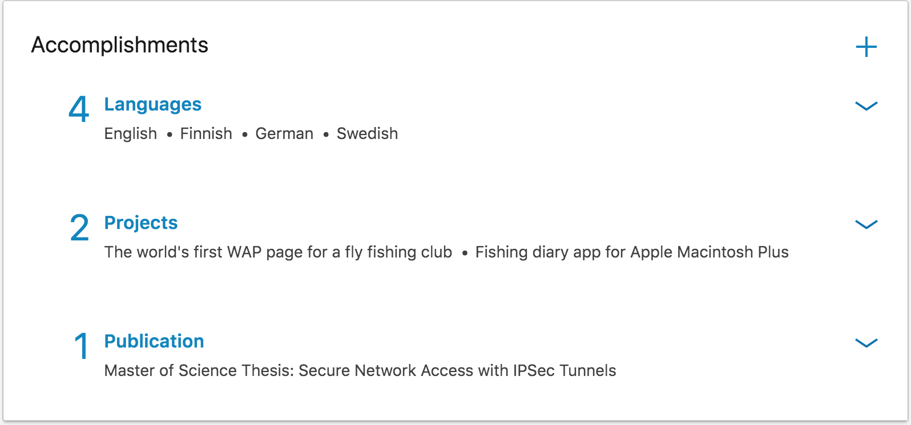

# 9. Accomplishments

## List all you relevant Publications, Patents, Certifications and Courses in detail

By now you should have already known this was coming. You're whole profile is about explaining your professional background, your current capabilities, and your future. For any of those, if you have anything published or passed that could back your words and give you more professional credibility, this is the place to showcase it!

---

## 9.1. List EVERY language you speak, even if it's only the basics 

Knowing some words in Japanese or French may not be enough for a conversation, but sometimes even that might be the differentiator compared to a person with no skills at all.

Interest to foreign languages is often connected to an interest in foreign cultures, and that's already a valued characteristic of a person, especially in any international business.

---

## 9.2. Publish your hobby projects if they are even remotely connected to your profession

**Don't underestimate the importance of your old hobby projects.**

They may not tell much about your capabilities today, but they can tell a lot about you as a person and can be very important as "ice-breakers" for someone interest to start a conversation with you, or show a shared history and/or interest together.

Coded simple games for C64 during the 90s and was featured in a PC magazine? Perfect, add the project photo and upload a photo of the page. Source codes still somehow available..? Even better, perfect for GitHub!

Interested in machine learning and coding some basic tests on free time? Great, if you're not already, make your project public and maybe get connected with people with similar interests!

