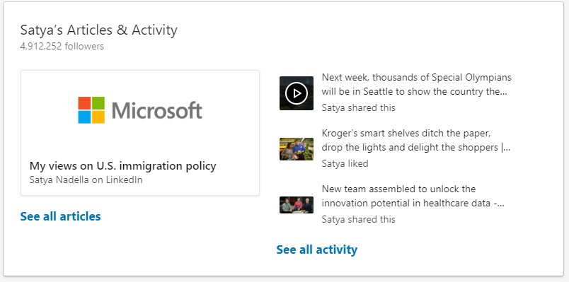

# Activity - I know what you did last summer...

Like it or not, LinkedIn IS a social media, and pretty much move you make is visible in your profile.

---

## Make sure you don't do stupid things that will be visible in your Activities section

**Activities section is very highly visible in your profile just below your summary.**

If you tried LinkedIn Articles years ago and posted something related to your job back then, that might be now screeming to  everyone visiting your profile. Make sure you have only Acticles that are relevant to your personal brand today, and simply remove the old ones.

Also your most recent likes, comments and shares get lot of visibility in LinkedIn. If you liked commented something stupid just as a joke, that will be visible to your potential client visiting your profile.

**Pro-tip:** Leave cat-videos to Facebook.
