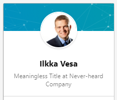

# 5. Is "Meaningless Title at Never-heard Company" your Headline of choice?

## 5.1. Give a good first impression

Your profile headline is visible on LinkedIn in almost everywhere next to your name. Also if someone is Googling your name, your headline is again shown in the Google Search results.

In most of the cases, with a profile photo, your headline is **the first impression** of you.

A successful LinkedIn headline should tell your client what your value proposition is, in practice "What I can do for YOU".

It should make them interested to click and open your profile and read learn more about you. If that happens... well, maybe the client opens someone else's profile!

---

## 5.2. Don't use LinkedIn default headline

By default, LinkedIn updates your headline to "Current title at Current Company". 

If you happen to be "Founder and CEO at Facebook" or "CTO at Google", I guess that's already enough. 

But for the rest of us, the default "[Long meaningless title] at [company you've never heard of]" can be completely irrelevant for a person hearing/reading it.

The headline is one of the most important, and difficult, parts of your brand, so don't leave it to the LinkedIn default.

> Would you buy a used car from a guy like this..?

---

## 5.3. Define your target client and wanted reactions

Go to [Goals page](goals.md).

---

## 5.4. Find your key selling point

Creating a perfect headline from the scratch is difficult. The other parts of your profile, like Experience and Education, are much easier to write as they are more just listing existing facts, whereas defining a key selling point can be a process of creating something new.

Often is easier to first list the things you want included in your headline without format or length constraints, and then try different versions in the target length.

You could e.g. start with writing down 1-2 sentence answers to the following questions:

1. Who/what you are? What your "role"?
2. What you're offering? What is your the most important capability you want to focus?
3. Whom are you working for? Who are your clients?
4. What is the value you create for your clients? What are the actual results?
5. How and why you're different?

You might end up something between 4 to 10 items, basically "raw material" for finding your key selling point, and LinkedIn headline.

---

## 5.5. Create an interesting, memorable and fun headline :)

**The most important thing about the headline is to understand that it's not for YOU, it's for your client.**

You want a person who sees just your profile photo, name and headline to get interested and click to open your full profile.

The maximum length of the Headline is 120 characters, but do you really need to use that all? **No, usually a shorter is better.**

In LinkedIn feed and search results, only first ~60 (in the mobile app) and ~90 (desktop website) characters are shown before cutting with "...". Only on the actual profile the whole 120 is visible.

With these length constraints, it is often hard to squeeze everything you want especially to the first 60 characters. Thus there is no one right way to form a good headline.

You can try to think about the headline in two parts:

1. The first 60 (or less) characters that are visible always
2. The second 60 (or less) characters that are guaranteed to be visible only when the profile is opened

From list collected earlier, think about which 2-3 things are the most important, and try to arrange them as the key message to the first 60 characters.

Then, what 1-2 other points you would like to (optionally) make? Add to the second part. The second part can be fully supporting the first points, but can also be a good part for a fun fact, or something creative and memorable.

**Two examples:**

*Helping the top tech talent to reach their true potential - and our clients to get shit done.*

[activity] [client] [value/results] - [secondary message, slightly more controversial language]

*Hunting the right projects for the best tech talent - not the other way around.*

[activity] [value/results] [client] - [secondary, supportive statement]

---

## 5.6. Test and iterate your headline

Ask comments and feedback to your drafts from your friends, preferably from people who belong to your target client group. A/B testing with different versions might also help.

Anyways the point is that headline is not something that will be carved on a stone, instead of something to develop and iterate over the time. 

And don't worry, it's usually hard to do anything worse than the default "Meaningless Job Title at The Company You've Never Heard Of".

---

## 5.7. "Show, don't tell"

Avoid using words like "experienced", "expert", "senior" and "specialist" in your headline (and in the whole profile). That's often easier said than done, but especially in the headline such words take valuable space and don't really add much value, sometimes actually the opposite: The world is so full of self-proclaimed "experts", that using such words can even have a negative first impression.

Instead, try to show your experience or specialist status. 

"10+ years in back-end solutions" can more powerful than "Back-end solutions specialist". Especially when you can prove that with later in your profile with work history, recommendations, and endorsements.

---

## 5.8. Don't use overused buzzwords

Have you heard about that genuinely innovative person who keeps on using "the i-word"? No, well me neither...

Also if you describe yourself as "Ninja" or something like that in LinkedIn, I'll take a screenshot of your profile and share that to everyone one day when you turn 25 and apply for some more serious position.

---

## 5.9. Use only terms that are familiar to your target clients

Your headline is not for you, it's for your client. Make sure the professional terms and possible acronyms are wildly known and accepted by your target clients.

It not your client's job, nor interest, to try to Google and figure out what your headline is trying to say.

---

## 5.10. Don't use weird symbols nor UPPERCASE

Don't use symbols like ➤, ◊, etc in your headline. Unless you're a teenager, or really able to deliver some truly unique ASCII art with one line of text.

Don't use all UPPERCASE letters, unless acronym or a brand name requires it ("IBM" instead of "ibm").

---

## 5.11. Don't use "seeking for opportunities" or "open for new challenges" in your headline

Very commonly used in LinkedIn, but gives an impression of a person passively waiting for someone to contact and ask.

That may work sometimes, but in general (also in job hunting) it's always better to take "the driver's seat", than wait for someone else to take the initiative. Or even worse, give that impression that you're just a passenger...

If your profile is interesting, people will contact you, even without saying "desperately looking" in your headline. You can also use LinkedIn's job-seeking settings to make sure you're profile will be flagged to recruiters etc as "actively looking".

If you want to describe more publicly about your interest to find a new job, or just consulting gigs, you can mention that at the end of your summary with more details about what you're looking for, and instructions how to contact you. (TODO: Link to Summary page) 

---

## 5.12. Test your headline on both mobile and desktop

If we decide to use the whole 120 characters, make sure to test it on both mobile and desktop to see what actually is that first impression you give. 

If most of your relevant message is not shown, you need to re-structure the headline.

---

## Examples from actual LinkedIn profiles

Copywriting artist transforming technical jargon from flat-line boring into a juicy novel-like page-turner

Former overweight food lover turned health nut coaching fellow foodies in the joys of the Paleo diet (YUM-O)

After I crunch the accounting numbers and maximize your tax refund, I’ll make you a cup of (Company Name) green tea.

As graphic designer at (Company Name), I redraw the marketing primer on knockout (print and web) layouts, every day.

20+ years of experience helping marketers meet their demand generation goals.

Tireless, caring Registered Nurse who helps pediatric cancer patients and their families feel at ease throughout treatment and recovery.

Reliable pet-sitter who will find out and report back to you exactly what your dog is up to when you’re not home.

Transitioning strategy into execution. Business development, change management, human capital and operations consultant

I work with organizations that want their teams to be more strategic, productive and profitable.

I’ve Helped 7 Companies Reach $1 Billion. Who wants to be #8?

I like to blow shit up. I am the Michael Bay of business.

Sales Associate: Saving companies time and money with automated expense reports.
