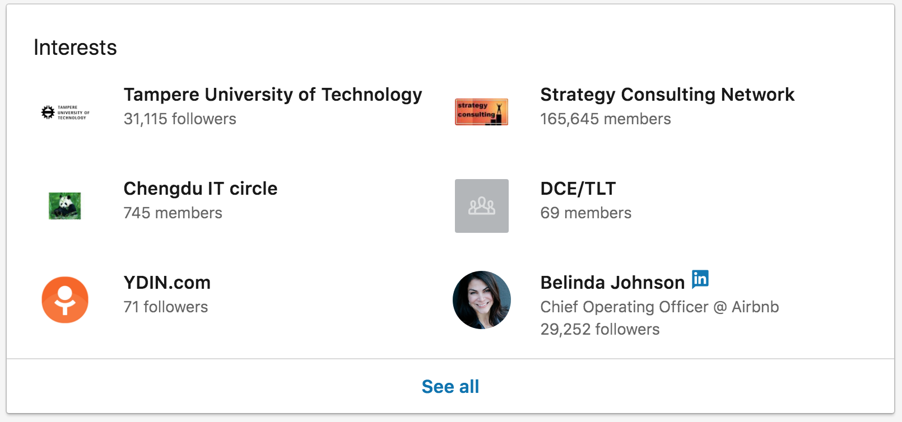

# 12. Interests

## 12.1. Remove unnecessary interests

LinkedIn shows by default 6 randomly selected interest in your profile, the whole list is then available behind "See all".

Remove companies and influencers, and leave groups, to make sure the ones are shown in your profile don't accidentally contain something that doesn't fit into your brand.

## 12.2. Follow companies and influencers

Follow companies and influencers that are interesting to you. Not only you see their updates in the feed (though most probably buried under too much content marketing...), but they're also visible in your profile and can tell a lot about you as a person.

## 12.2. Join relevant professional LinkedIn groups

Join groups that are professionally interesting to you and fit into your brand. Not only they will be visible in your profile, but can also make finding and contacting you easier through that group. 

E.g. if your part of "React Native Professionals", your profile may get additional hits by people searching for React Native developers. Also, it can be for you a small connecting "bridge" when meeting new people: "I see we're both in Startups in Singapore group".

## 12.3. Make sure you're in all work and school alumni groups

Some companies have very active and powerful alumni, the best example is perhaps McKinsey (https://alumni.mckinsey.com/). Join all school and previous companies alumni LinkedIn groups, even to less active ones.
