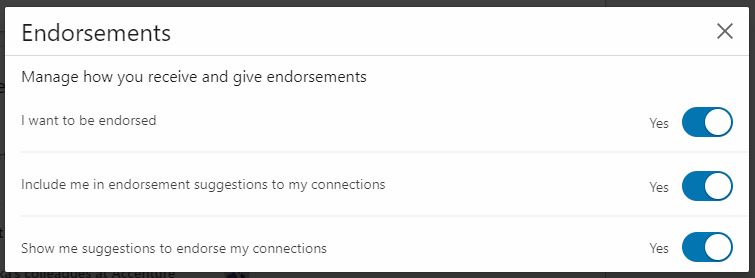
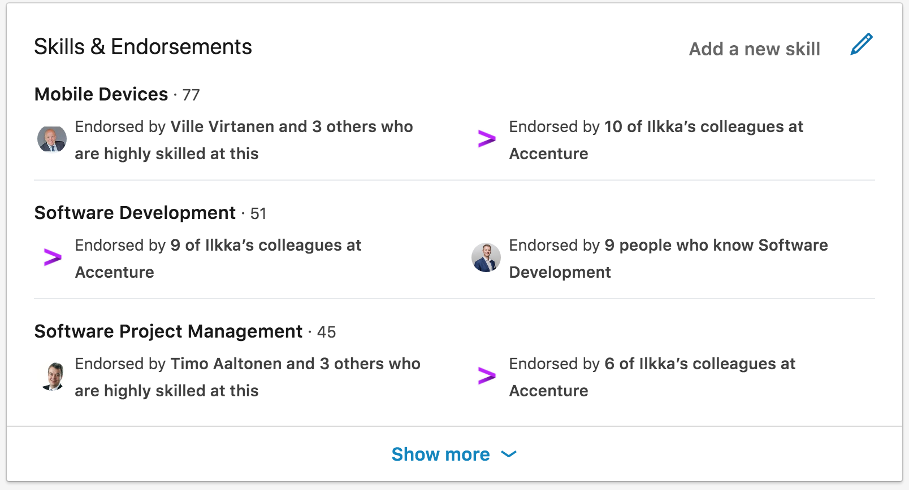

# Skills and Endorsements

LinkedIn endorsement model is maybe bit annoying, but as long as that's the approach used by the most important professional networking, it's better to use the tool to your benefit than to ignore it.

Even though a lot of the endorsements people are giving can be total rubbish, if you want to promote your brand e.g. as a leading security expert, and 100+ people in your network are endorsing you on "Internet Security" that definitely won't hurt your brand...

## Enable LinkedIn endorsements in settings

Make sure you have all three settings enabled. 

## Make sure your TOP3 skills fit and support your brand

TOP3 skills are visible in the profile, even without opening the skills section. By default, the TOP3 are selected based on how many endorsements you have got, but you can also manually re-arrange and change your TOP3 skills.

Make sure you select the 3 most relevant skills to TOP3 that fits and supports your brand.

## Add missing skills

LinkedIn has a limit of max 50 skills listed. Add manually if some of the skills you want to highlight are missing.

## Remove any possible un-wanted skills

If some skills are not relevant to your profile, or even conflicting with your brand, simply remove them, even if other people have given you endorsements.

Having a shorter and focused set of skills is better than a long list of everything from A to Z. Having 2-3 endorsement on something as abstract as "Integration" doesn't really improve the profile.

## Give endorsements

Last but not least, go through your network of people and endorse people for the skills they deserve to be endorsed. That's how all those endorsements to your own profile also came.
