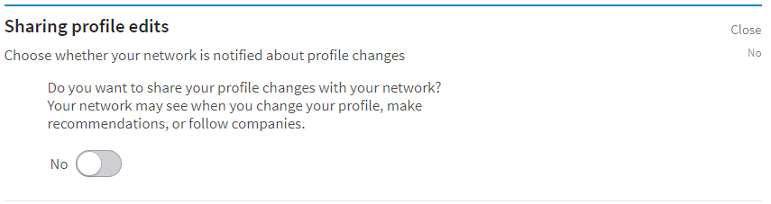
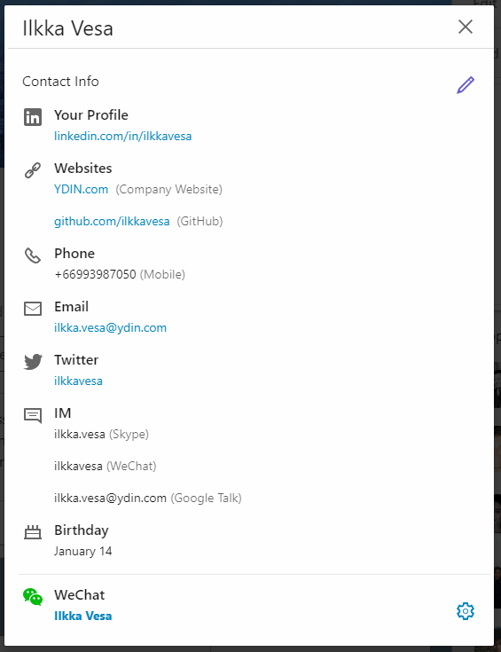
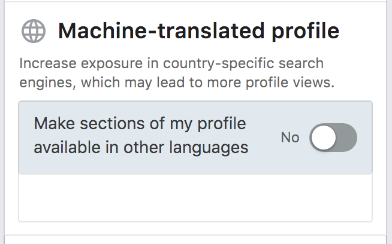

# Don't ruin everything with wrong Settings

LinkedIn settings are not necessarily as easy as they could be, so pay attention. As even if you build a perfect profile, it doesn't do much if your settings are wrong and it's not properly visible to your target clients!

---

## Make sure you understand "Share with network" setting

Before you start, do you want LinkedIn to broadcast every change you make to your network? For example, your boss seeing you polishing your online CV can be a strong signal that sometimes you want to send, but sometimes to avoid...

Better safe than sorry, always before LinkedIn edits check you publishing settings (Settings -> Privacy):

---

## Customize you profile public web address

LinkedIn allows you to customize your profile public web address, but surprisingly many people don't seem to know about it.

So instead of the default format [www.linkedin.com/in/firstname-lastname-1234567](www.linkedin.com/in/firstname-lastname-1234567) you can shorten it to [www.linkedin.com/in/yourname](www.linkedin.com/in/yourname). 

> A small thing, but makes promoting your profile easier - and you won't look like an amateur anymore

Also, a bit of consistency in branding never hurts:

- [linkedin.com/in/ilkkavesa](https://linkedin.com/in/ilkkavesa)
- [github.com/ilkkavesa](https://github.com/ilkkavesa)
- [angel.co/ilkkavesa](https://angel.co/ilkkavesa)
- [facebook.com/ilkkavesa](https://facebook.com/ilkkavesa)
- [twitter.com/ilkkavesa](https://twitter.com/ilkkavesa)
- [instagram.com/ilkkavesa](https://www.instagram.com/ilkkavesa)

And so on... got the point?

For instructions:
[https://www.linkedin.com/help/linkedin/answer/87/customizing-your-public-profile-url?lang=en](https://www.linkedin.com/help/linkedin/answer/87/customizing-your-public-profile-url?lang=en)

---

## Set your Visibility settings to the MAX

An awesome LinkedIn profile itself is pretty useless if no one can see it.

If you have reasons to limit your profile visibility, you're most probably not even reading this.

---

## Make sure your connections can see your connections

By default, your connections can see who you're connected with. You can turn that off from settings, but I wouldn't recommend it.

What's the point of networking, if you're not... networking?

---

## Add your up-to-date contact information

LinkedIn is good helping people connect on LinkedIn, but not doing as good job in showing real work contact information. So if you want to be easily contacted, and by now I trust you do, you need to put a bit extra effort here.

Make sure your contact information (email, mobile, etc) is up-to-date on LinkedIn, as it is shown to contacts in your network. Focus on methods you know your potential clients might prefer to use.

If you want to ensure also people outside of your network easily contact you, you can add to end of your summary instructions how to contact you, e.g. your email and/or phone number.

The worst thing that can happen is that you miss a deal because client wasn't able to find your contacts. Wouldn't be the first time...

---

## Add multiple email addresses to your profile

Add **all old and current email addresses** your potential clients might use when trying to search for you.

LinkedIn allows you to add multiple email addresses to your profile, of which on only one marked as "Primary" and will be shown in your profile.

Other email addresses are not shown in your profile, but your profile can be still found with Google Search by those email addresses. Also, several email clients are using LinkedIn API to fetch information based on email addresses.

---

## Add your own web links

Understandably, LinkedIn doesn't want visitors to jump into other websites, and thus doesn't really promote adding web links to your profile.

However, you should still add your relevant personal websites, Github profiles, online portfolios, etc (as seen in the pic above).

---

## Show your full name in the profile to all

You can limit who can see your full name on LinkedIn, or of course create a profile with a fake name. But I would strongly recommend to forget such ideas.

Set the visibility of your full name to be visible all.

---

## Match your location with your goals

Your location is not only visible in your profile, but used a lot to filter search results. Make sure your location is up-to-date and not misleading.

If you're traveling a lot or working and living in more than one countries, choose your "home location" based on how it fits your goals, as people may draw conclusions about you based on your location.

---

## Turn-off machine translations unless you specifically want them

The problem is that translations will be shown e.g. in Google results (bug in LinkedIn? https://productforums.google.com/forum/#!topic/websearch/xd9k8NtTps8)

---

## Test your profile visibility

As said, the LinkedIn visibility settings can be bit tricky, so be sure make sure you run tests:

1. Google your name (you should do this regularly anyways!)
2. Open your profile in "incognito mode" in browser
3. Ask your friend who you're connected in LinkedIn to open your profile (and look over shoulder...)
4. Ask someone who you're not connected (but has a LinkedIn account) to open your profile